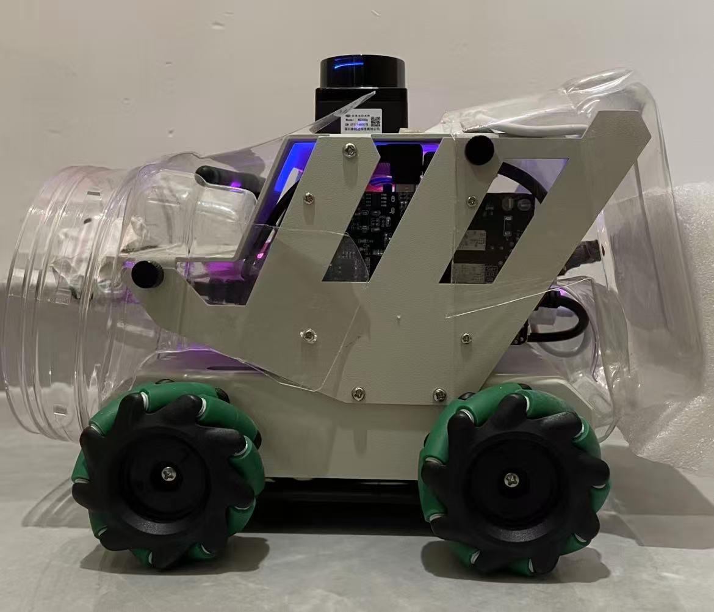
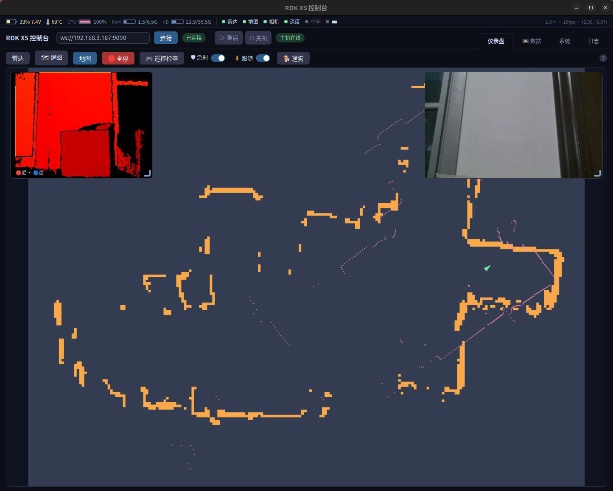
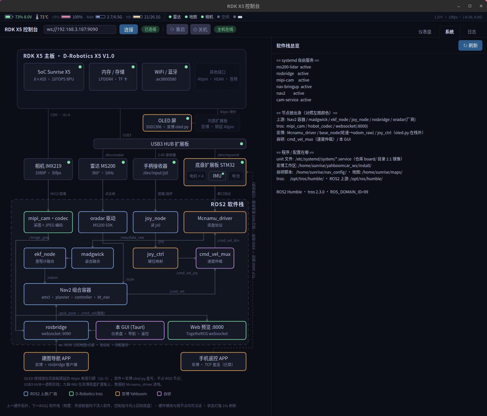
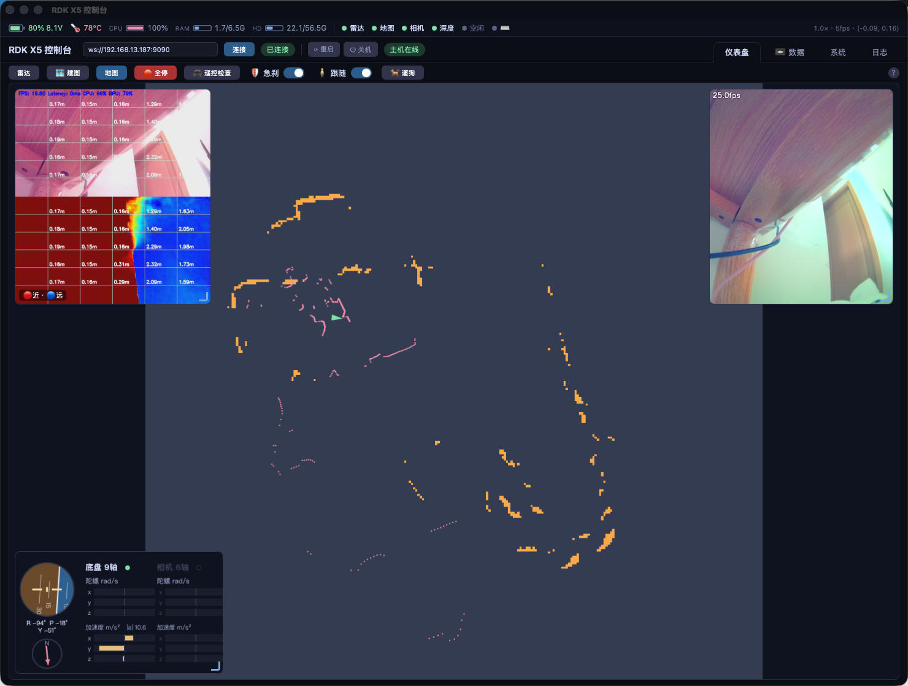
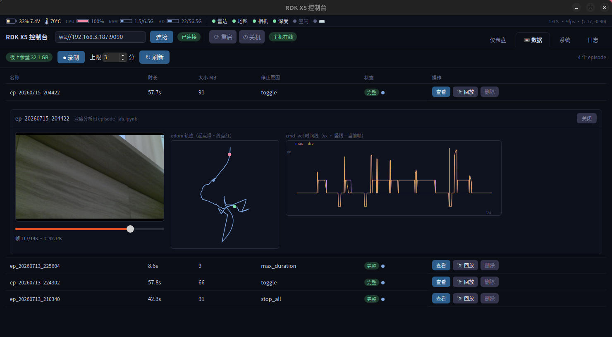

# RDK X5 Robot 实验记录 / Experiments

亚博（Yahboom）**RDK X5 ROBOT** 麦克纳姆轮小车上的机器人实验：自主导航、融合跟随、
反应式漫游、深度感知、数据录制，外加一个自研桌面控制台。主控为地平线 D-Robotics
**RDK X5**（8×Cortex-A55 + 10 TOPS BPU），预装 Ubuntu 22.04 + ROS2 Humble + TogetheROS（tros）。

> 传感器布局：顶部 ORADAR MS200 激光雷达（360° / 10 Hz）；车头 **GS130WI 双目立体相机**
> （双 SC132GS 全局快门 + 板载 6 轴 IMU，BPU stereonet 出深度，替换原 IMX219 CSI 单目），
> USB Orbbec Astra Pro 结构光深度相机为可选替代；四轮麦克纳姆轮（全向移动）。



**接入 / 冷启动 / WiFi / VNC / 相机预览**等环境配置见
👉 [`docs/setup.md`](docs/setup.md)。日常 `ssh root@192.168.13.187`，开机自启全套服务，直接做实验。

---

## 实验一览 / Experiments at a glance

| 实验 | 状态 | 入口 |
| --- | --- | --- |
| 桌面控制台 GUI（Tauri，4 Tab） | ✅ | §1 |
| Cartographer 建图 + Nav2 自主导航 + GUI 一键建图/存图 | ✅ 实测 | §2 |
| cmd_vel 安全仲裁 + 驱动崩溃自愈 + 激光急刹 safety_stop | ✅ 实测 | §2.2 / §2.3 |
| Follow-me 相机 + 雷达融合跟随 | ✅ 实测 | §3.1 |
| 遛狗模式：纯反应式雷达漫游/闻/后退/转身 | ✅ 已部署 | §3.2 |
| 双目立体深度预览（GS130WI，BPU stereonet）+ USB Astra 备选 | ✅ 实测 | §4 |
| Episode 数据录制（rosbag2）+ 数据 Tab | ✅ 实测 | §5 |
| 官方实验取舍与进阶路线（4090 端云推理） | 📝 规划 | [`docs/…advanced-practice.html`](docs/rdk-x5-official-experiments-and-advanced-practice.html) |

---

## 1. 桌面控制台 GUI（Tauri 自研）

`gui/` 下的跨平台桌面应用（Tauri + rosbridge websocket），把散落的浏览器页面收敛成一个控制台，
四个 Tab：

- **仪表盘** — 地图（AMCL 定位，绿箭头为车）+ 雷达点云（粉）+ **右上彩色画中画** + **左上深度画中画**
  （红近蓝远）；点击地图任意点 = 📍 图钉落地 + 下发导航目标；顶栏按钮：建图/存图、🛡 急刹、
  🧍 跟随、🐕 遛狗、🛑 全停。
- **📼 数据** — episode 列表 / 录制 / 行内回看 / 本机 RViz 回放 / 拉取删除（§5）。
- **系统** — 实机核实的硬件拓扑 + ROS2 软件栈框图（节点按出身着色）。
- **日志** — 板上 journald 流式查看。

状态栏：电量 / 温度 / CPU / 内存 / 硬盘 + 各话题活性灯（含深度流 `iDepth`）。



**系统 Tab**：硬件拓扑 + 软件栈框图，右侧汇总 systemd 服务与程序/配置落盘位置——新人看一屏就懂整车软件：



架构细节（进程模型、rosbridge 订阅清单、离线降级、悬浮窗拖拽公用件）见
[`docs/rdk-x5-gui-architecture.html`](docs/rdk-x5-gui-architecture.html)。

---

## 2. 建图与 Nav2 自主导航（实机验证 ✅）

- **建图（GUI 一键工作流）**：仪表盘 `🗺 建图` 启停 `mapping.service`（仅 cartographer，
  `Conflicts=nav2` 与导航互斥交接）；手柄慢速走一圈，画布实时显示地图生长，
  **暗橙 = 存图会被三值化丢掉的弱墙**（置信 25–65），近补扫变亮橙再存；`💾 存图` 备份旧图 →
  覆盖 `room.{yaml,pgm}` → 自动切回导航。详见 [`docs/rdk-x5-mapping-workflow.html`](docs/rdk-x5-mapping-workflow.html)。
- **导航**：`navigation_dwb_launch.py`（Nav2 + AMCL + DWB），关键调参 `nav_params_tuned.yaml`：
  `robot_radius 0.1→0.13`、膨胀半径 `→0.35`（否则贴桌腿擦过必撞）、限速 0.18 调通后提至 0.6。
- **交互**：GUI 点击地图任意点即下发目标（📍 图钉常驻最新目标，`🛑 全停`取消）。

### 2.1 开机自启服务

unit 在 [`board/etc/systemd/system/`](board/etc/systemd/system/)，重启实测通过：

| 服务 | 作用 |
|---|---|
| `ms200-lidar` | 雷达驱动，发布 `/scan` |
| `rosbridge` | DDS → WebSocket 桥（`ws://<板子IP>:9090`） |
| `camera-preview` | 相机预览自动探测：GS130WI 双目 CSI → `stereo_cam.py`；USB Astra → `astra_preview.py`（§4）。插什么用什么，取代退役的 `mipi-cam`/`astra-cam` |
| `nav-bringup` | 底盘驱动 + 里程计/EKF + 手柄 + cmd_vel 仲裁 mux + episode 录制器（§5）+ 遛狗节点（§3.2） |
| `nav2` | AMCL + 规划器 + 控制器（自动喂初始位姿；无目标不动车） |
| `follow-me` | BPU 感知 ×3 + 融合跟随节点（GUI 开关控制，§3.1） |

另有按需单元 `mapping`（不自启，`Conflicts=nav2`，GUI `🗺 建图` 启停）。

```bash
# 换地图/重喂定位：sudo bash /home/sunrise/nav_config/nav_start.sh [map.yaml]
# 重刷机后恢复：电脑上跑 scripts/deploy_board.sh（rsync board/ 镜像 + enable 服务）
```

### 2.2 cmd_vel 安全仲裁与事故复盘（重要）

**仲裁 mux**（[`cmd_vel_mux.py`](board/home/sunrise/nav_config/cmd_vel_mux.py)，自研）四级优先级汇入：
`/cmd_vel_joy`(手柄) > `/cmd_vel_dog`(遛狗) > `/cmd_vel_follow`(跟随) > `/cmd_vel`(Nav2)
→ §2.3 激光急刹 → `/cmd_vel_drv` → 驱动。导航/跟随中动手柄立即接管，松手 0.5 s 恢复；
**空闲持续发零速**（10 Hz）；另带**方向感知雷达护栏**（沿运动方向 ±30° 取最近障碍线性限速）。

- **事故复盘**：亚博 `Mcnamu_driver` 的 RGB 灯 I2C 写入无异常保护，按手柄键可致
  **驱动崩死 → MCU 持续执行最后一条非零速度 → ROS 层任何停车全部失效**。
  修复 = 驱动 `respawn=True` + mux 空闲零速流，实测行驶中 `kill -9` 驱动 ≈1.5 s 内自动刹停。
  **浏览器/GUI 的"终止"不是急停**（WiFi 断了它就是块砖）；真急停 = 手柄使能键 / 拎车 / 电源开关。
- **欠压坑**：`/voltage` ≤7.6 V（2S 18650，满 8.4 V）扩展板蜂鸣 + 限电机，驱动 I2C 大面积报错，
  表现酷似"遥控坏了"——先看电池条，唯一解是充电。
- **手机 APP 互斥**：亚博 APP 直写串口（不走 ROS），与驱动双写抢串口致车抽搐，XFCE 自启已禁。
- **systemd 坑**：厂商 `cam-service` 单元 `After` 与 `WantedBy` 都指 `multi-user.target`，
  任何 `After=cam-service` 会构成依赖环 → 开机静默丢 job（无日志）。

### 2.3 激光急刹 safety_stop（rclcpp，实测 ✅）

自研 C++ 节点 [`ros2_ws/src/safety_stop/`](board/home/sunrise/ros2_ws/src/safety_stop/)，串在 mux 与驱动之间，
过滤**最终输出**（手柄/跟随/Nav2 一视同仁）：

- **净空比例限速,非固定阈值**：沿运动方向 ±30° 取最近障碍，允许速度 =(净空−0.30)/0.5，0.30 m 归零。
  实测固定 30 cm 阈值在 1 m/s 全速刹不住（雷达 10 Hz 延迟 + 滑行），比例限速全速冲墙可停。
- **方向感知,永不锁死**：前进查前、倒车查后、横移查侧；背离障碍永远放行；原地旋转不拦。
- **fail-open**：雷达挂了放行（手柄不陪葬），跟随通道在 mux 层另有 fail-close 兜底。
- **运行时开关**：默认开；GUI `🛡 急刹` 或手柄键发 `/safety_toggle` 翻转，latched `/safety_enabled` 广播；
  开 = 滴滴两短,关 = 长滴一声（走 `/Buzzer`）。

---

## 3. 自主行为 / Autonomous behaviors

### 3.1 Follow-me：相机 + 雷达融合跟随（实测可用 ✅）

自研 rclpy 节点 [`follow_me.py`](board/home/sunrise/follow/follow_me.py)：对相机比 **👌 OK** 锁定主人开始跟随，
**✋ 手掌**停止。核心是**两条观测通道常开并行,不做模式切换**——相机 + BPU 给身份/方位角/尺度（~30 FPS），
MS200 雷达腿聚类给精确距离方位（10 Hz，含车后）；单控制环 10–40 Hz 融合，相机暗了无缝落雷达。关键设计：

- **认腿 = 运动判别**：桌腿凳腿尺寸与人腿不可分，唯一可靠特征是"会动"；用 `/odom` 换算世界系抵消自身运动，
  新咬合要求该位置 1.2 s 前是空的，持有中若 3 s 世界系静止且相机也黑则判定跟错家具、放弃。
- **麦轮矢量速度**：速度向量直指主人（不等车头转过去）+ PD 转向甩头；直行 0.5，斜向最高 0.8 m/s。
- **安全**：跟随速度同样过 §2.2 mux 护栏与手柄抢占；感知超时 3 s 强制刹停。

算法细节（门限、状态机、手势投票、踩坑六条）见 [`docs/rdk-x5-follow-me-fusion.html`](docs/rdk-x5-follow-me-fusion.html)。
> 注：跟随最初基于 IMX219 单目开发，现已适配 **GS130WI 双目**——`follow_start.sh` 用同一 EEPROM 探测
> 认出双目后喂右眼 `/image_color_full`（1088×1280，注入内参 fx/cx 与肩宽先验），单目 `/image_raw` 为回退。

### 3.2 遛狗模式：纯反应式雷达漫游（已部署）

自研 rclpy 节点 [`dog_walk.py`](board/home/sunrise/nav_config/dog_walk.py)：小车像小狗一样走走停停闻闻——
朝最空方向**三角波变速**小跑（空旷快，≤0.5 m/s），撞见桌脚凳脚一类**孤立小障碍**凑近"闻"几秒、
后退一小步、朝净空方向转身去下一处。**不用地图 / 不用 Nav2 / 不用 odom** —— 就是单帧 MS200 的反应式行为。

- **认腿**：物理宽度 [0.02,0.3] m + 最少点数 + 连续 3 帧一致（不用 odom）；随机加权开阔方向选路。
- **停动作不停功能**：mux 里遛狗排 P1（跟随/Nav2 之上），启遛狗即在总线层压住它们的运动，
  但**功能开关/服务原样在**，遛狗一停立刻续上；反向靠单次 `/dog_stop` 抢占。
- **触发/安全**：手柄 **R1 键** / GUI **🐕 遛狗** 按钮切换（启 = 两短滴,停 = 一长滴,GUI 显示已跑秒数），
  最长 10 min 自动停；抓杆即退出、雷达失联 fail-close 停车、Y 键 / 🛑 全停一并停。

设计与 codex 评审（三处坏品味被推翻）见 [`docs/rdk-x5-dog-walk-design.html`](docs/rdk-x5-dog-walk-design.html)。

---

## 4. 双目立体深度相机（GS130WI，BPU stereonet，实测 ✅）

车头装 **微雪 RDK Stereo Camera GS130WI**——双 SC132GS **全局快门**（1.3 MP，机器人运动无果冻）
+ 板载 ICM-42688-P 六轴 IMU + 硬件同步双目曝光。深度伪彩进 GUI 左上窗（红近蓝远），彩色进右上窗。
`camera-preview.service` 开机按硬件身份自探测拉起：EEPROM `"UNION"` 头 → 双目
[`stereo_cam.py`](board/home/sunrise/nav_config/stereo_cam.py)，否则 USB Astra → `astra_preview.py`。



- **深度走 BPU（NPU）**：出厂 UNION EEPROM 标定（基线 69.69 mm）→ stereoRectify → combine 双目 NV12
  → 官方 `hobot_stereonet`（DStereoV2.4 int8，BPU 占用低）→ JET 上色发 `/camera/depth/color_jpeg`；
  彩色右眼 NV12 走**硬件 JENC** 发 `/image_jpeg`。热路径全下沉 C++（`stereo_combine_pkg`）+ daemon 内
  seqlock 零拷贝配对，全栈负载下实测 **深度 ~14–17 fps / 彩色 ~20 fps**。
- **60 fps 自由跑**：SC132GS 出厂运行于外触发模式（帧率=X5 LPWM 脉冲频率），流中热打 `0x3222=0` 切
  自由跑解锁双眼 60 fps；彩色/深度各自 python 线程，避免抢 GIL/BPU 互相拖垮。
- **彩色偏品红是物理限制,非配置 bug**：模组**无 IR-cut 滤光片**（NIR 850/940 nm 增强是卖点），室内近红外
  灌爆 R/B，AWB 算不出色温 → CCM 不套用；乘性增益修不了加性污染，真修复只有硬件加 650 nm IR-cut。
  软件侧做了径向色度扣除兜底（大面积表面必被中和，局部真彩存活）。
- **可选 USB Astra 路径**：插 USB Orbbec Astra Pro 时自探测走**裸 OpenNI2（primesense）直读**深度
  （绕开亚博 `astra_camera` 驱动关激光/LDP 关不掉致深度恒 0 的坑），LUT 上色发同一 `/camera/depth/color_jpeg`；
  USB2 带宽下深度（bulk）与彩色（UVC）互斥，彩色默认关，量程约 0.6–8 m。

bring-up 全程（两 CSI 电气核实、EEPROM 标定解码、60 fps 解锁、BPU 喂料链、C++ 零拷贝、IR-cut 结案）见
[`docs/gs130wi-stereo-camera-bringup.html`](docs/gs130wi-stereo-camera-bringup.html)；踩坑记忆在
`.memory/rdk-x5-stereo-camera.md`，Astra 路径在 `.memory/rdk-x5-astra-depth.md`。

---

## 5. Episode 数据录制与回放（rosbag2，实测 ✅）

为模仿学习/数据集积累做的一键示教录制：手柄 **START** 或 GUI 数据 Tab `⏺ 录制` 开停，板端常驻节点
[`episode_recorder.py`](board/home/sunrise/nav_config/episode_recorder.py)（随 `nav-bringup` 起）把 11 个话题
（scan/odom/tf/各级 cmd_vel/joy/相机 JPEG）录成 `~/episodes/ep_<时间戳>/`，蜂鸣反馈、磁盘护栏、时长上限。
复用**单一属主模式**：节点持有状态，手柄/GUI 只发 `/record_toggle` 翻转 + 镜像 latched `/recording`。

**GUI 📼 数据 Tab**：episode 列表（倒序/大小/时长/余量）、行内展开快速回看（帧滑条 + odom 轨迹 +
cmd_vel 时间轴，≤150 帧抽样 preview）、`🔭 回放` 一键拉包本机 RViz2 复现（`scripts/replay.sh`）、拉取/删除。



深度分析用 [`notebooks/episode_lab.ipynb`](notebooks/episode_lab.ipynb)；设计与评审见
[`docs/rdk-x5-dataset-recorder-design.html`](docs/rdk-x5-dataset-recorder-design.html)。

---

## 6. 硬件速览 / Hardware

| 部件 | 规格 |
| --- | --- |
| 主控 | 地平线 **RDK X5 V1.0**（8×Cortex-A55 @1.5 GHz + BPU Bayes-e 10 TOPS，6.5 GiB LPDDR4） |
| 深度相机 | **GS130WI 双目立体**（双 SC132GS 全局快门 CSI + 板载 ICM-42688-P 六轴 IMU；BPU stereonet 深度，基线 69.69 mm）。可选 **Orbbec Astra Pro**（USB 结构光，OpenNI2）。原 Sony IMX219 单目已退役 |
| 激光雷达 | **ORADAR MS200** 360° 10 Hz，0.15–20 m（`/dev/oradar`） |
| 底盘 | 麦克纳姆轮 ×4 + STM32 扩展板（串口 `/dev/myserial`，含 IMU/电池管理） |
| 其他 | AIC8800 WiFi/BT、OLED 状态屏、2.4G 手柄接收器、40-pin GPIO |

完整体检（存储/总线/内核模块/温度）见 [`docs/rdk-x5-system-report.html`](docs/rdk-x5-system-report.html)。

---

## 7. 目录结构 / Repo layout

```
RDK-experience/
├── README.md                       # 本文件：实验记录主线
├── CLAUDE.md / AGENTS.md           # 给 AI 协作工具的项目说明
├── .memory/                        # 跨工具持久记忆（协议 SKILL.md + 索引 + 事实）
├── board/                          # 板端文件 1:1 镜像（重刷机一键恢复）
│   ├── etc/systemd/system/         #   服务 unit（自启，§2.1）
│   ├── home/sunrise/nav_config/    #   导航/录制/遛狗/深度相机自定义件
│   │                               #   （bringup/mux/joy_teleop/episode_*/dog_walk/stereo_cam/astra_preview/map_save）
│   ├── home/sunrise/follow/        #   Follow-me 融合跟随（follow_me.py + follow_start.sh）
│   ├── home/sunrise/ros2_ws/       #   rclcpp 自研包（safety_stop 激光急刹）
│   └── home/sunrise/scripts/       #   WiFi 切换 / 相机模式切换等板端脚本
├── gui/                            # 桌面控制台（Tauri + rosbridge，§1）
│   ├── src-tauri/                  #   Rust 后端（ssh 命令、服务开关、episode 管理、单实例）
│   └── ui/                         #   前端（仪表盘/数据/系统/日志四 Tab；floatbox 悬浮窗公用件）
├── notebooks/                      # 工作站分析 notebook（episode_lab / strafe_test）
├── scripts/                        # 主机侧工具（deploy_board / replay / rviz）
└── docs/                           # 设计文档（HTML+内嵌 SVG）、截图、setup 指南
```
